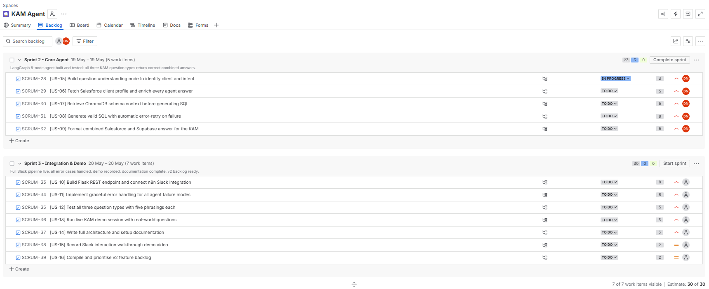
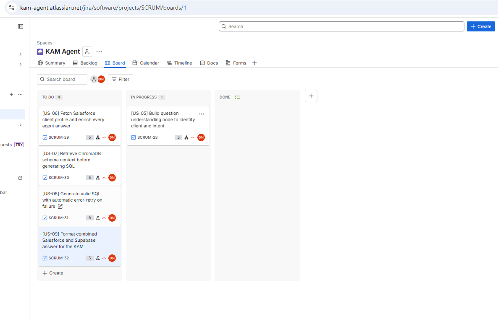

# Sprint 2, Day 2

### Kanban with Sprint2:






### Langgraph skeleton : `agent.py`

* The state flows through:

- understand_question → fetch_salesforce_client → retrieve_schema → generate_sql → execute_sql → format_answer, with the error-retry branch from execute_sql back to generate_sql.

* `AgentState` is a single TypedDict that flows through all nodes. Every field is `Optional` — nodes add to it incrementally. Key fields: `retry_count` (drives the error-retry branch), `usage` (each node appends its token/query counts), `cost_summary` (written by `format_answer`).

### Nodes

| Node | Status | What it does |
|---|---|---|
| `understand_question` | ✅ Live | Calls gpt-4o-mini to extract `client_name`, `question_type`, and `intent_summary` from the raw question |
| `fetch_salesforce_client` | 🔧 Stub | Fetches the client account record from Salesforce (SOQL) |
| `retrieve_schema` | 🔧 Stub | Retrieves relevant table/column descriptions from ChromaDB before SQL generation |
| `generate_sql` | 🔧 Stub | Calls gpt-4o-mini to generate a SQL query using the schema context; receives the previous error on retry |
| `execute_sql` | 🔧 Stub | Runs the SQL against Supabase; increments `retry_count` on error |
| `format_answer` | 🔧 Stub | Combines Salesforce + Supabase results into a Slack-ready answer; calculates query cost |


### Result from running agent.py - Smoke Test:

[Node 1] understand_question
  Question: How many suppliers does Check24 have?
  → client_name:    Check24
  → question_type:  supplier_count
  → intent_summary: The KAM wants to know the number of suppliers associated with Check24.
  → tokens: 196 in / 41 out

[Node 2] fetch_salesforce_client
  Client: Check24 — STUB (implement Day 3)

[Node 3] retrieve_schema
  Query: The KAM wants to know the number of suppliers associated with Check24. — STUB (implement Day 3)

[Node 4] generate_sql
  STUB (implement Day 3)

[Node 5] execute_sql
  SQL: SELECT s.name, COUNT(p.id) AS product_count FROM supplier s -- STUB
  STUB (implement Day 3)

[Node 6] format_answer
  STUB (implement Day 3)
  → Total cost:    $0.000162
  → Total tokens:  611 in / 121 out
  → Supabase queries: 1 (free tier)

── FINAL ANSWER ──
*Client:* Check24 ← from Salesforce
Account tier: STUB
Business model: STUB — not yet fetched
Contract status: STUB
KAM: STUB

*Operational data (Supabase):*
[
  {
    "supplier": "STUB — Supabase not yet connected",
    "product_count": 0
  }
]

_(STUB — full formatting implemented Day 3)_

💰 *Query cost:* $0.000162 | 611↑ 121↓ tokens | 1 Supabase query (free tier)

── PARSED INTENT ──
  client_name:   Check24
  question_type: supplier_count
  intent:        The KAM wants to know the number of suppliers associated with Check24.

── COST SUMMARY ──
  understand_question            gpt-4o-mini                  196↑   41↓ tokens  sq:0  $0.000054
  retrieve_schema                text-embedding-3-small        15↑    0↓ tokens  sq:0  $0.000000
  generate_sql                   gpt-4o-mini                  400↑   80↓ tokens  sq:0  $0.000108
  execute_sql                    supabase                       0↑    0↓ tokens  sq:1  $0.000000
  TOTAL                                                       611↑  121↓ tokens  sq:1  $0.000162

---

[Node 1] understand_question
  Question: Which products does Avis have connected to Autoslash?
  → client_name:    Autoslash
  → question_type:  product_list
  → intent_summary: The KAM wants to know about the products offered by Avis for Autoslash.
  → tokens: 198 in / 42 out

[Node 2] fetch_salesforce_client
  Client: Autoslash — STUB (implement Day 3)

[Node 3] retrieve_schema
  Query: The KAM wants to know about the products offered by Avis for Autoslash. — STUB (implement Day 3)

[Node 4] generate_sql
  STUB (implement Day 3)

[Node 5] execute_sql
  SQL: SELECT s.name, COUNT(p.id) AS product_count FROM supplier s -- STUB
  STUB (implement Day 3)

[Node 6] format_answer
  STUB (implement Day 3)
  → Total cost:    $0.000163
  → Total tokens:  613 in / 122 out
  → Supabase queries: 1 (free tier)

── FINAL ANSWER ──
*Client:* Autoslash ← from Salesforce
Account tier: STUB
Business model: STUB — not yet fetched
Contract status: STUB
KAM: STUB

*Operational data (Supabase):*
[
  {
    "supplier": "STUB — Supabase not yet connected",
    "product_count": 0
  }
]

_(STUB — full formatting implemented Day 3)_

💰 *Query cost:* $0.000163 | 613↑ 122↓ tokens | 1 Supabase query (free tier)

── PARSED INTENT ──
  client_name:   Autoslash
  question_type: product_list
  intent:        The KAM wants to know about the products offered by Avis for Autoslash.

── COST SUMMARY ──
  understand_question            gpt-4o-mini                  198↑   42↓ tokens  sq:0  $0.000055
  retrieve_schema                text-embedding-3-small        15↑    0↓ tokens  sq:0  $0.000000
  generate_sql                   gpt-4o-mini                  400↑   80↓ tokens  sq:0  $0.000108
  execute_sql                    supabase                       0↑    0↓ tokens  sq:1  $0.000000
  TOTAL                                                       613↑  122↓ tokens  sq:1  $0.000163

---

[Node 1] understand_question
  Question: What are the details of Check24's inbound products from Germany?
  → client_name:    Check24
  → question_type:  product_details
  → intent_summary: The KAM wants to know the details of Check24's inbound products from Germany.
  → tokens: 201 in / 43 out

[Node 2] fetch_salesforce_client
  Client: Check24 — STUB (implement Day 3)

[Node 3] retrieve_schema
  Query: The KAM wants to know the details of Check24's inbound products from Germany. — STUB (implement Day 3)

[Node 4] generate_sql
  STUB (implement Day 3)

[Node 5] execute_sql
  SQL: SELECT s.name, COUNT(p.id) AS product_count FROM supplier s -- STUB
  STUB (implement Day 3)

[Node 6] format_answer
  STUB (implement Day 3)
  → Total cost:    $0.000164
  → Total tokens:  616 in / 123 out
  → Supabase queries: 1 (free tier)

── FINAL ANSWER ──
*Client:* Check24 ← from Salesforce
Account tier: STUB
Business model: STUB — not yet fetched
Contract status: STUB
KAM: STUB

*Operational data (Supabase):*
[
  {
    "supplier": "STUB — Supabase not yet connected",
    "product_count": 0
  }
]

_(STUB — full formatting implemented Day 3)_

💰 *Query cost:* $0.000164 | 616↑ 123↓ tokens | 1 Supabase query (free tier)

── PARSED INTENT ──
  client_name:   Check24
  question_type: product_details
  intent:        The KAM wants to know the details of Check24's inbound products from Germany.

── COST SUMMARY ──
  understand_question            gpt-4o-mini                  201↑   43↓ tokens  sq:0  $0.000056
  retrieve_schema                text-embedding-3-small        15↑    0↓ tokens  sq:0  $0.000000
  generate_sql                   gpt-4o-mini                  400↑   80↓ tokens  sq:0  $0.000108
  execute_sql                    supabase                       0↑    0↓ tokens  sq:1  $0.000000
  TOTAL                                                       616↑  123↓ tokens  sq:1  $0.000164
```


### Summary of the results:

* **Node 1 is live and accurate** — all three questions parsed correctly: right `client_name`, right `question_type`, and a sensible `intent_summary`. Real tokens recorded (196–201 in, 41–43 out).

* **Cost tracking is working** — the per-node breakdown is clean and totals add up correctly. Average cost per query: ~$0.000163, which is approximately **$0.16 per 1,000 queries**.

* **`generate_sql` stub tokens dominate** — the fixed 400/80 stub values represent the largest cost share right now. Once the real LLM call is wired in Sprint 3, this will fluctuate based on actual schema context size.

* **`retrieve_schema` stub is 15 tokens** — when ChromaDB is live, the real embedding call will use the full `intent_summary` (~30–40 tokens), so the actual cost will be marginally higher but still negligible at `text-embedding-3-small` pricing.