# Sprint 3, Day 3

### Kanban with Sprint3:

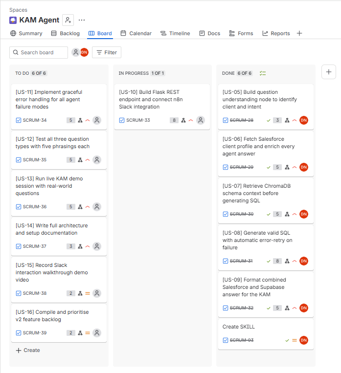

## US-10 —  Flask REST endpoint and connect n8n Slack integration

* The flow is: Slack trigger → Filter bot messages → POST /ask → check ok flag → post answer (thread reply) or post error

* **First Step**: setting up workspace in Slack: 

- To invite others: https://join.slack.com/t/kamagentdev/shared_invite/zt-3yge5t5ar-l7DdJojmGPPiF2skzNwAow

- creating the app:
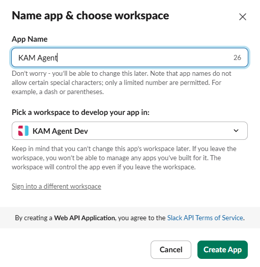

- => all credentials are inserted in .env file

**Second Step:** seeting up n8n workflow

- Setup Webhook trigger node:
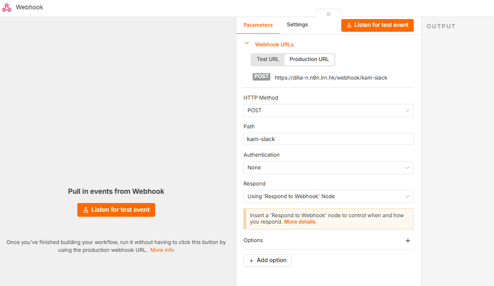

- Slack Post Answer and Post Error, also setup successfully
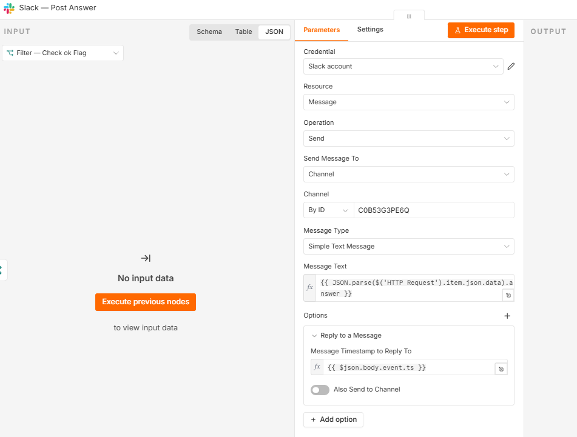

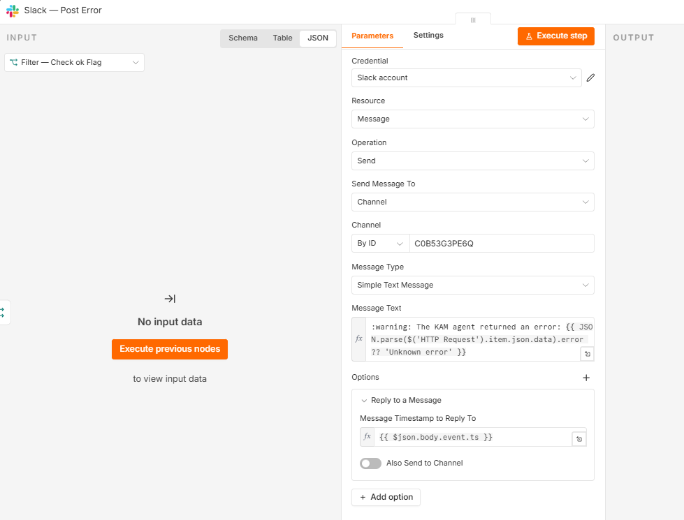

* Connecting Slack and n8n:
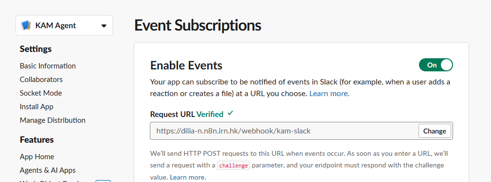

* n8n workflow:
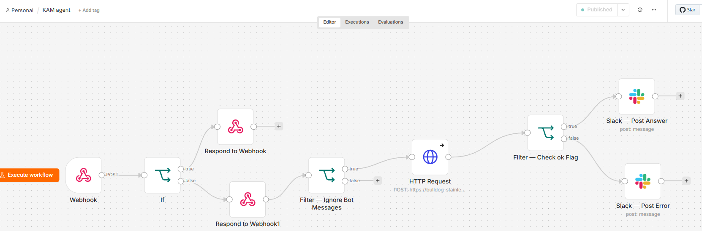

**Summary:**
* ✅ Slack app created (KAM Agent)
* ✅ Bot token: xoxb-... in .env
* ✅ Channel #kam-agent created, bot invited
* ✅ Channel ID: C0B53G3PE6Q in .env
* ✅ n8n workflow published
* ✅ Webhook verified by Slack
* ✅ Bot events subscribed

* **Test in slack:**

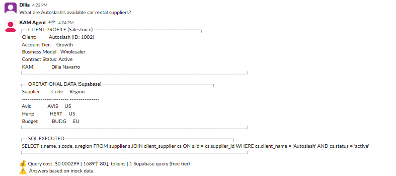

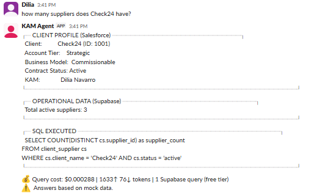

## US-11 — Error handling tests

### **Test1- Unknown client:** Example: How many suppliers does Booking.com have?

*Response in Slack

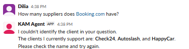

*Response is compatible with response in Terminal. No API called made.

---
[Node 1] understand_question
  Question: How many suppliers does <http://Booking.com|Booking.com> have?
2026-05-20 16:38:42 [INFO] HTTP Request: POST https://api.openai.com/v1/chat/completions "HTTP/1.1 200 OK"
  → client_name:    None
  → question_type:  supplier_count
  → intent_summary: The KAM wants to know the number of suppliers for Booking.com.
  → tokens: 222 in / 38 out
  WARNING: Client not recognised — short-circuiting to END
  → No client name — short-circuiting to END
2026-05-20 16:38:42 [INFO] POST /ask  client=None  type=supplier_count  cost=$0.000000

---

**Test 1  PASS** ✅

* Unknown client correctly identified ✅
* Short-circuited to END after Node 1 ✅
* Friendly fallback message in Slack ✅
* No unnecessary API calls (cost: $0.000000) ✅

* Note: Slack auto-linked Booking.com as a URL — the agent handled it gracefully anyway.

### **Test2- Ambiguous question:** Example: Tell me about rates

* Response in slack:

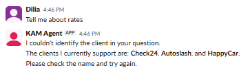

* Compatible with response in Terminal

---

2026-05-20 16:46:13 [INFO] POST /ask  question='Tell me about rates'  export_xlsx=True

[Node 1] understand_question
  Question: Tell me about rates
2026-05-20 16:46:16 [INFO] HTTP Request: POST https://api.openai.com/v1/chat/completions "HTTP/1.1 200 OK"
  → client_name:    None
  → question_type:  product_details
  → intent_summary: The KAM wants to know about rates.
  → tokens: 211 in / 33 out
  WARNING: Client not recognised — short-circuiting to END
  → No client name — short-circuiting to END
2026-05-20 16:46:16 [INFO] POST /ask  client=None  type=product_details  cost=$0.000000
2026-05-20 16:46:16 [INFO] 127.0.0.1 - - [20/May/2026 16:46:16] "POST /ask HTTP/1.1" 200 -
---

**Test 2 PASS** ✅

* No client identified → short-circuit to END ✅
* Friendly fallback message in Slack ✅
* Cost: $0.000000 ✅

### **Test3- Valid client, no data match:** Example: What are HappyCar's active products from Antarctica?

* Slack response:

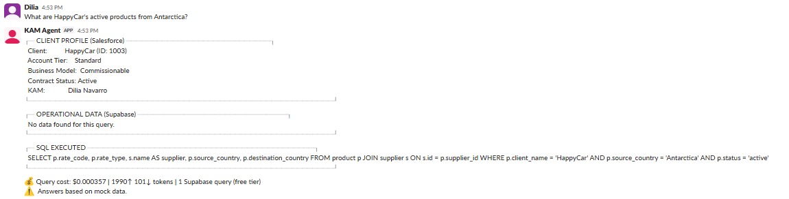

* Compatible with response in Terminal

---
2026-05-20 16:53:37 [INFO] POST /ask  question="What are HappyCar's active products from Antarctica?"  export_xlsx=True

[Node 1] understand_question
  Question: What are HappyCar's active products from Antarctica?
2026-05-20 16:53:40 [INFO] HTTP Request: POST https://api.openai.com/v1/chat/completions "HTTP/1.1 200 OK"
  → client_name:    HappyCar
  → question_type:  product_list
  → intent_summary: The KAM wants to know which products HappyCar has for Antarctica.
  → tokens: 217 in / 40 out

[Node 2] fetch_salesforce_client
  Client: HappyCar
  ✓ Found in Salesforce:
    business_model:  Commissionable
    account_tier:    Standard
    contract_status: Active
    kam:             Dilia Navarro

[Node 3] retrieve_schema
  Query: The KAM wants to know which products HappyCar has for Antarctica.
2026-05-20 16:53:42 [ERROR] Failed to send telemetry event ClientStartEvent: capture() takes 1 positional argument but 3 were given
2026-05-20 16:53:42 [INFO] HTTP Request: POST https://api.openai.com/v1/embeddings "HTTP/1.1 200 OK"
  ✓ Retrieved 3 documents:
    glossary_rate_codes  (distance: 1.3005)
    glossary_clients  (distance: 1.3273)
    query_patterns  (distance: 1.3395)
  → embedding tokens (est.): 16

[Node 4] generate_sql
2026-05-20 16:53:46 [INFO] HTTP Request: POST https://api.openai.com/v1/chat/completions "HTTP/1.1 200 OK"
  → SQL: SELECT p.rate_code, p.rate_type, s.name AS supplier, p.source_country, p.destination_country FROM product p JOIN supplie...
  → tokens: 1757 in / 61 out

[Node 5] execute_sql
  SQL: SELECT p.rate_code, p.rate_type, s.name AS supplier, p.source_country, p.destination_country FROM product p JOIN supplie...
2026-05-20 16:53:47 [INFO] HTTP Request: POST https://ttsojqwczzjnumptwyfw.supabase.co/rest/v1/rpc/execute_sql "HTTP/2 200 OK"
  ✓ Query returned 0 row(s)

[Node 6] format_answer
  → Total cost:    $0.000357
  → Total tokens:  1990 in / 101 out
  → Supabase queries: 1 (free tier)
2026-05-20 16:53:47 [INFO] POST /ask  client=HappyCar  type=product_list  cost=$0.000357
2026-05-20 16:53:47 [INFO] 127.0.0.1 - - [20/May/2026 16:53:47] "POST /ask HTTP/1.1" 200 -
---

**Test 3 PASS** ✅

* HappyCar fetched from Salesforce correctly ✅
* SQL executed correctly with Antarctica filter ✅
* Zero rows returned → "No data found for this query." ✅
* Clean response in Slack, no crash ✅

### **Test4- SQL error after retry:** 

Valid question: How many suppliers does Check24 have?. A line was inserted in 

*Forcing SQL to fail in NODE5:
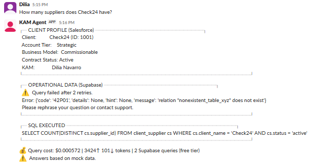

* Compatible with response in Terminal

---
2026-05-20 17:22:30 [INFO] POST /ask  question='How many suppliers does Check24 have?'  export_xlsx=True

[Node 1] understand_question
  Question: How many suppliers does Check24 have?
2026-05-20 17:22:32 [INFO] HTTP Request: POST https://api.openai.com/v1/chat/completions "HTTP/1.1 200 OK"
  → client_name:    Check24
  → question_type:  supplier_count
  → intent_summary: The KAM wants to know the number of suppliers associated with Check24.
  → tokens: 215 in / 41 out

[Node 2] fetch_salesforce_client
  Client: Check24
  ✓ Found in Salesforce:
    business_model:  Commissionable
    account_tier:    Strategic
    contract_status: Active
    kam:             Dilia Navarro

[Node 3] retrieve_schema
  Query: The KAM wants to know the number of suppliers associated with Check24.
2026-05-20 17:22:34 [ERROR] Failed to send telemetry event ClientStartEvent: capture() takes 1 positional argument but 3 were given
2026-05-20 17:22:35 [INFO] HTTP Request: POST https://api.openai.com/v1/embeddings "HTTP/1.1 200 OK"
2026-05-20 17:22:35 [ERROR] Failed to send telemetry event CollectionQueryEvent: capture() takes 1 positional argument but 3 were given
  ✓ Retrieved 3 documents:
    query_patterns  (distance: 1.1327)
    table_product  (distance: 1.1517)
    table_client_supplier  (distance: 1.2517)
  → embedding tokens (est.): 17

[Node 4] generate_sql
2026-05-20 17:22:36 [INFO] HTTP Request: POST https://api.openai.com/v1/chat/completions "HTTP/1.1 200 OK"
  → SQL: SELECT COUNT(DISTINCT cs.supplier_id) FROM client_supplier cs WHERE cs.client_name = 'Check24' AND cs.status = 'active'
  → tokens: 1570 in / 30 out

[Node 5] execute_sql
  SQL: SELECT COUNT(DISTINCT cs.supplier_id) FROM client_supplier cs WHERE cs.client_name = 'Check24' AND cs.status = 'active'
2026-05-20 17:22:36 [INFO] HTTP Request: POST https://ttsojqwczzjnumptwyfw.supabase.co/rest/v1/rpc/execute_sql "HTTP/2 404 Not Found"
  ✗ SQL execution failed: {'code': '42P01', 'details': None, 'hint': None, 'message': 'relation "nonexistent_table_xyz" does not exist'}
  → SQL error, routing back to generate_sql (retry 1)

[Node 4] generate_sql
  Retry #1 — previous error: {'code': '42P01', 'details': None, 'hint': None, 'message': 'relation "nonexistent_table_xyz" does not exist'}
2026-05-20 17:22:38 [INFO] HTTP Request: POST https://api.openai.com/v1/chat/completions "HTTP/1.1 200 OK"
  → SQL: SELECT COUNT(DISTINCT cs.supplier_id) FROM client_supplier cs WHERE cs.client_name = 'Check24' AND cs.status = 'active'
  → tokens: 1622 in / 30 out

[Node 5] execute_sql
  SQL: SELECT COUNT(DISTINCT cs.supplier_id) FROM client_supplier cs WHERE cs.client_name = 'Check24' AND cs.status = 'active'
2026-05-20 17:22:38 [INFO] HTTP Request: POST https://ttsojqwczzjnumptwyfw.supabase.co/rest/v1/rpc/execute_sql "HTTP/2 404 Not Found"
  ✗ SQL execution failed: {'code': '42P01', 'details': None, 'hint': None, 'message': 'relation "nonexistent_table_xyz" does not exist'}

[Node 6] format_answer
  → Total cost:    $0.000572
  → Total tokens:  3424 in / 101 out
  → Supabase queries: 2 (free tier)
2026-05-20 17:22:38 [INFO] POST /ask  client=Check24  type=supplier_count  cost=$0.000572
2026-05-20 17:22:38 [INFO] 127.0.0.1 - - [20/May/2026 17:22:38] "POST /ask HTTP/1.1" 200 -
---

**Test 4 PASS** ✅ — SQL retry exhausted → user-friendly error message

* Retry triggered after first failure ✅
* Retry 1 attempted and failed ✅
* After 2 retries exhausted → routed to format_answer ✅
* Clear error message in Slack ✅
* Cost tracked: $0.000572 | 2 Supabase queries ✅

## US-12 — Test all three question types with five phrasings each

First, checking if thread reply is working properly:

* Example:
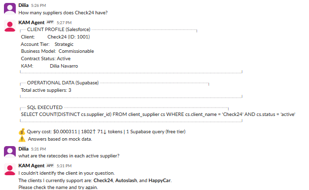

* This means the thread_ts is not working.  

* Fix:

* Adding a Set node:
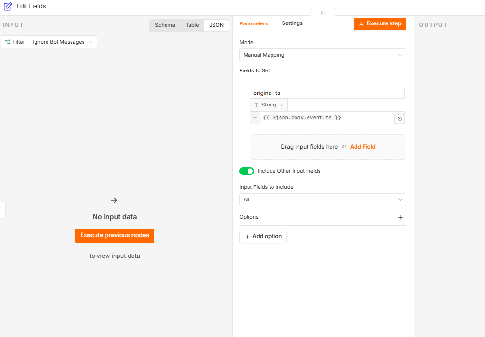

*n8n workflow:
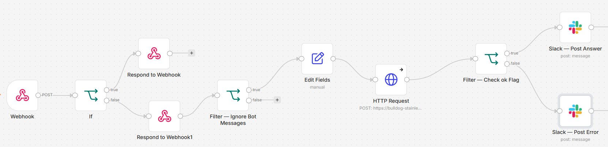

* Testing thread:

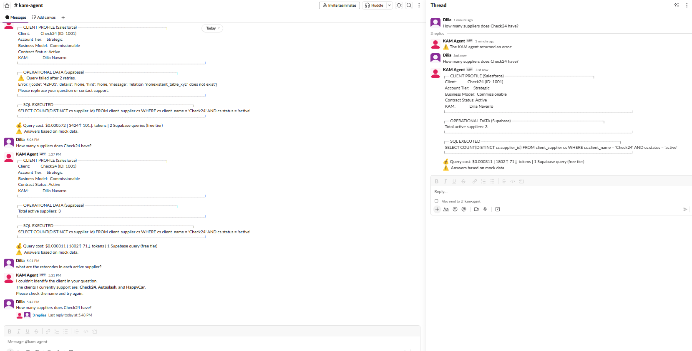

### Testing in Batches 3 questions, 5 different ways:

**Batch1: supplier_count**

* Q1: How many suppliers does Check24 have?

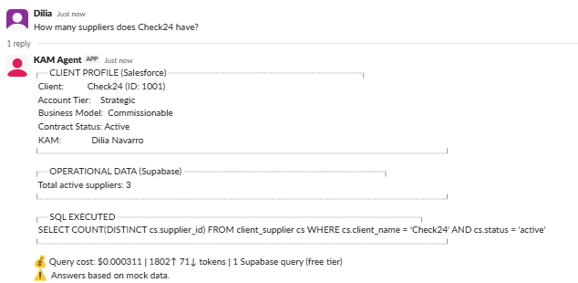

* Q2: How many active suppliers are connected to Autoslash?

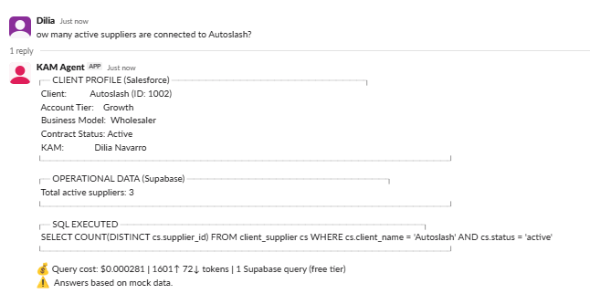

* Q3: What is the number of suppliers for HappyCar?

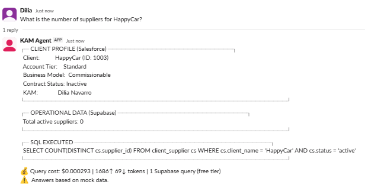

* Q4: Can you tell me Check24's supplier count?

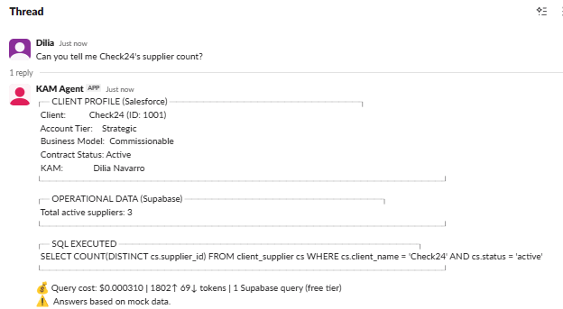

* Q5: How many car rental companies work with Autoslash?

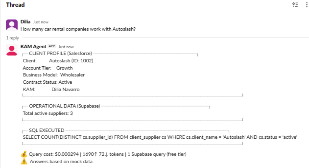

* All results are correct! - supplier_count complete ✅

**Batch2: supplier_list**

* Q1: What are Autoslash's available car rental suppliers?

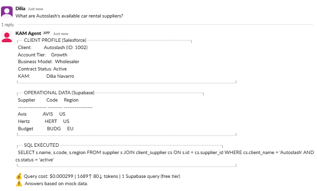

* Q2: Which suppliers does Check24 work with?

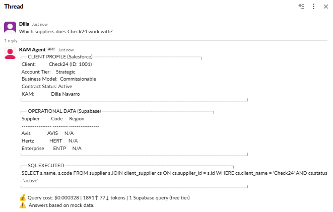

* Q3: List the suppliers connected to HappyCar

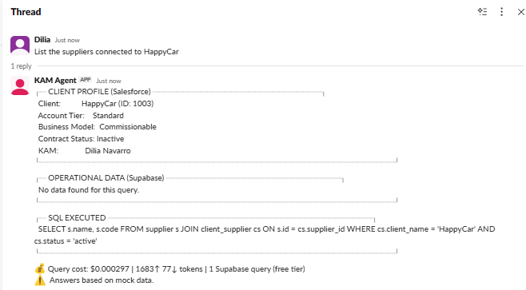

* Q4: Who are Check24's rental partners?

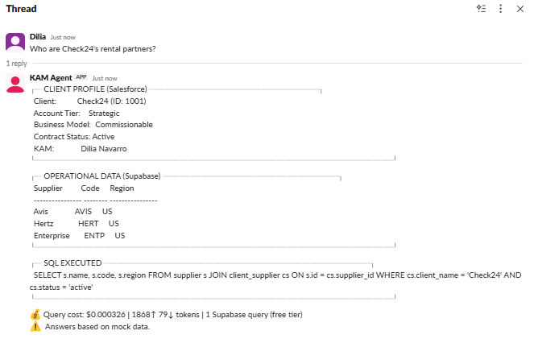

* Q5: Show me all suppliers for Autoslash

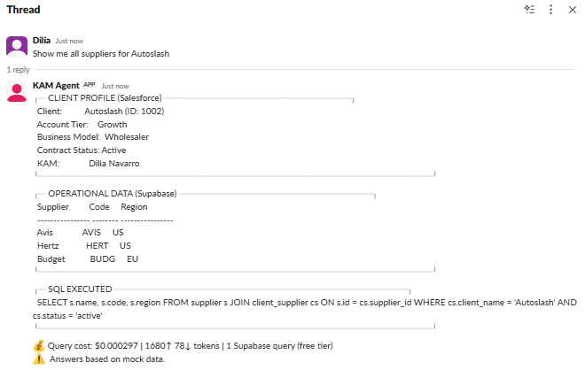

* Batch2 ✅ PASS — supplier_list | Autoslash | Avis, Hertz, Budget | threaded ✅
* Batch2 supplier_list complete ✅

**Batch3: product_details (5 phrasings)**

* Q1: What are the rate details for Check24 with Avis?

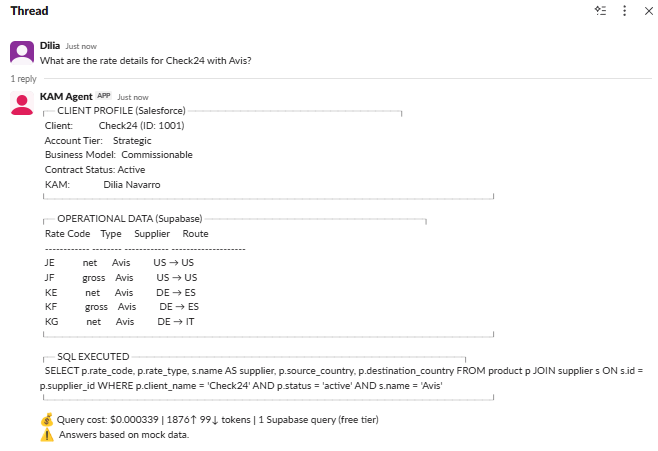

* Q2: Show me Check24's products from Germany

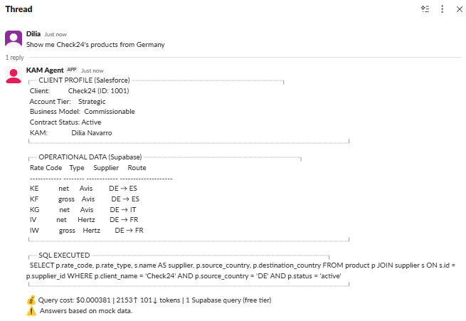

* Q3: What routes does Hertz cover for Autoslash?

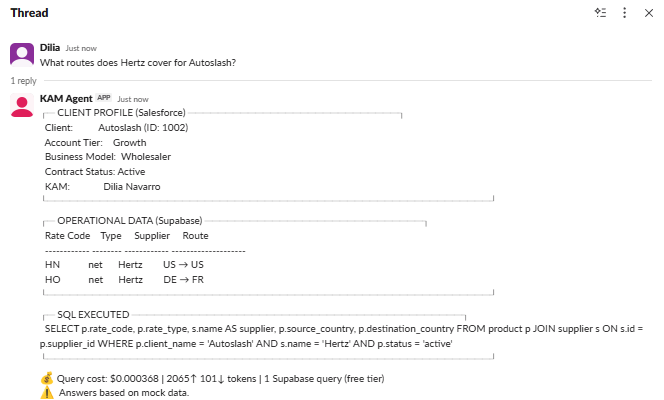

* Q4: Give me the product details for Autoslash with Budget

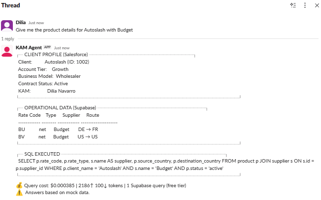

* Q5: What are HappyCar's inbound products from France?

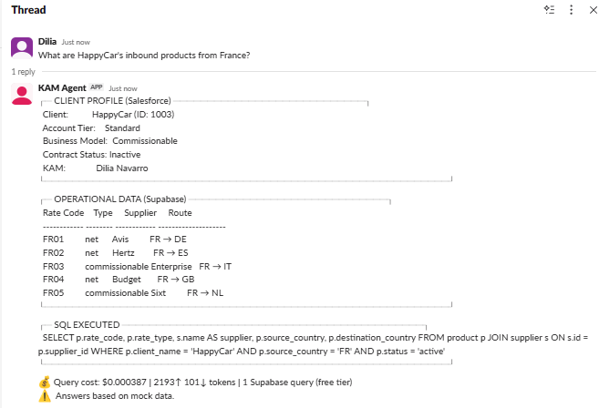

### US-12 is now fully complete — 15/15

Changes made to achieve the results:

* Fetching node from SalesForce was amended: "contract_status": "Active" if raw.get("Active__c") == "Yes" else "Inactive",

* Key rules for generating SQL were made more narrow: 
KEY RULES:
  - Always filter by status = 'active' unless the question asks about inactive records
  - client_name values are case-sensitive: 'Check24', 'Autoslash', 'HappyCar'
  - Supplier name values are: 'Avis', 'Hertz', 'Enterprise', 'Budget', 'Sixt'
  - To filter by supplier name always JOIN supplier and use: supplier.name = '<name>'
    NEVER use supplier.code to look up a supplier by name — code is uppercase (e.g. 'AVIS')
    and is NOT the same as the supplier name
  - JOIN supplier using: supplier.id = product.supplier_id
                     or: supplier.id = client_supplier.supplier_id
  - When querying products for a specific client, filter using product.client_name directly
    DO NOT also join client_supplier — this causes duplicate rows
    Only join client_supplier when you need connection-level data (e.g. supplier count per client)
  - Return only a single valid SELECT statement — no explanations, no markdown
  - For product_details queries ALWAYS include s.name AS supplier in the SELECT
  - For product_details queries the SELECT must always be exactly:
    SELECT p.rate_code, p.rate_type, s.name AS supplier, p.source_country, p.destination_country
    NEVER select p.product_type in product_details queries
  - For geographic filters, 'inbound products FROM [country]' means source_country = '[ISO code]'
    NEVER use destination_country for the origin/source of a product
  - 'inbound' means the product originates outside and comes IN — source_country is the origin
  - Country names must be converted to ISO 3166-1 alpha-2 codes:
    France = 'FR', Germany = 'DE', Spain = 'ES', Italy = 'IT', UK = 'GB'
  - Always filter p.status = 'active' — never 'inactive'
"""

## US-13 — Run live KAM demo session with real-world questions

**Demo script — suggested question set covering all 3 types:**

* Q1: "How many suppliers does Check24 have?" (supplier_count)
* Q2: "Which suppliers work with Autoslash?" (supplier_list)
* Q3: "What are HappyCar's inbound products from France?" (product_details)
* Q4: "Show me all ratecodes connected to Check24" (product_details)

* Q1: 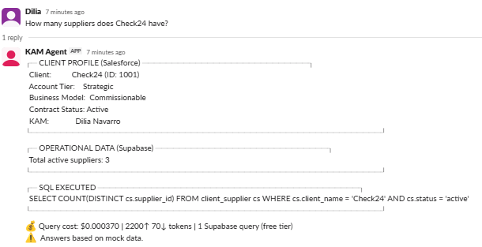

* Q2: 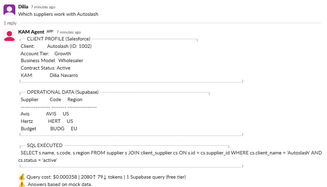

* Q3: 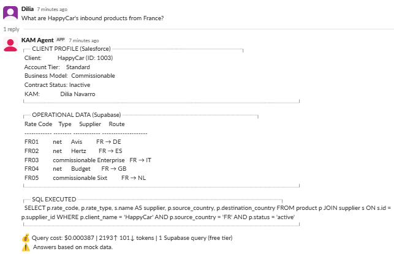

* Q4:
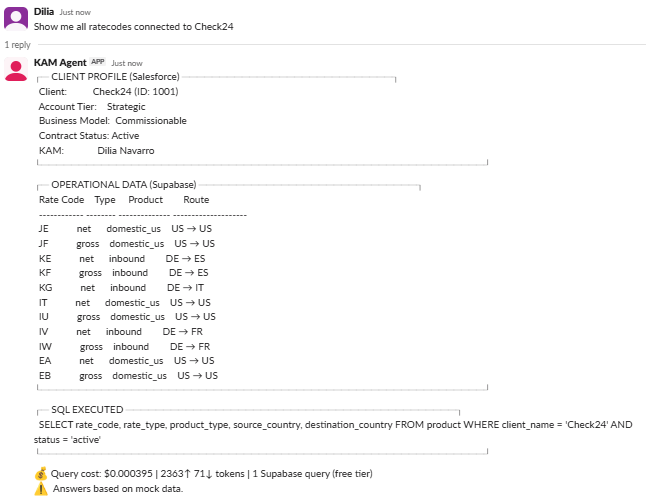

*Logs:
---
2026-05-20 21:45:45 [INFO] POST /ask  question='Show me all ratecodes connected to Check24'  export_xlsx=True

[Node 1] understand_question
  Question: Show me all ratecodes connected to Check24
2026-05-20 21:45:47 [INFO] HTTP Request: POST https://api.openai.com/v1/chat/completions "HTTP/1.1 200 OK"
  → client_name:    Check24
  → question_type:  product_list
  → intent_summary: The KAM wants to know all rate codes associated with Check24.
  → tokens: 362 in / 40 out

[Node 2] fetch_salesforce_client
  Client: Check24
  ✓ Found in Salesforce:
    business_model:  Commissionable
    account_tier:    Strategic
    contract_status: Active
    kam:             Dilia Navarro

[Node 3] retrieve_schema
  Query: The KAM wants to know all rate codes associated with Check24.
2026-05-20 21:45:49 [ERROR] Failed to send telemetry event ClientStartEvent: capture() takes 1 positional argument but 3 were given
2026-05-20 21:45:49 [INFO] HTTP Request: POST https://api.openai.com/v1/embeddings "HTTP/1.1 200 OK"
  ✓ Retrieved 3 documents:
    glossary_rate_codes  (distance: 0.8629)
    table_product  (distance: 0.8756)
    glossary_business_models  (distance: 1.1121)
  → embedding tokens (est.): 15

[Node 4] generate_sql
2026-05-20 21:45:50 [INFO] HTTP Request: POST https://api.openai.com/v1/chat/completions "HTTP/1.1 200 OK"
  → SQL: SELECT rate_code, rate_type, product_type, source_country, destination_country FROM product WHERE client_name = 'Check24...
  → tokens: 1986 in / 31 out

[Node 5] execute_sql
  SQL: SELECT rate_code, rate_type, product_type, source_country, destination_country FROM product WHERE client_name = 'Check24...
2026-05-20 21:45:51 [INFO] HTTP Request: POST https://ttsojqwczzjnumptwyfw.supabase.co/rest/v1/rpc/execute_sql "HTTP/2 200 OK"
  ✓ Query returned 11 row(s)
  → Sample: {"rate_code": "JE", "rate_type": "net", "product_type": "domestic_us", "source_country": "US", "destination_country": "US"}

[Node 6] format_answer
  → Total cost:    $0.000395
  → Total tokens:  2363 in / 71 out
  → Supabase queries: 1 (free tier)
  → XLSX exported: ./exports\Check24_product_list_2026-05-20.xlsx
2026-05-20 21:45:51 [INFO] POST /ask  client=Check24  type=product_list  cost=$0.000395
2026-05-20 21:45:51 [INFO] 127.0.0.1 - - [20/May/2026 21:45:51] "POST /ask HTTP/1.1" 200 -
---

## Excel file to be delivered via Slack

**Changes applied in:** 
* agent_format_answer.py
* server.py
* n8n workflow

- The file will only be delivered if requested via slack, and only when there is tabular information. When it does not apply a gentle message will be sent back to the user.

* New n8n workflow:

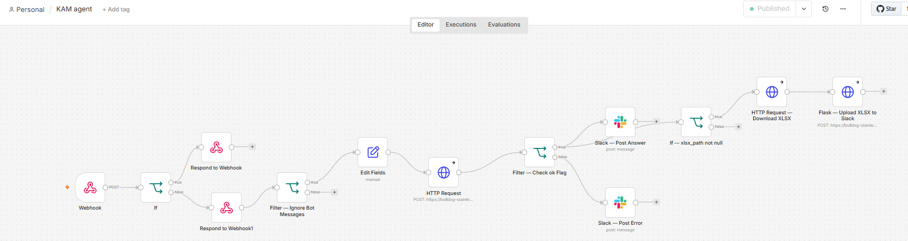

* Slack response:

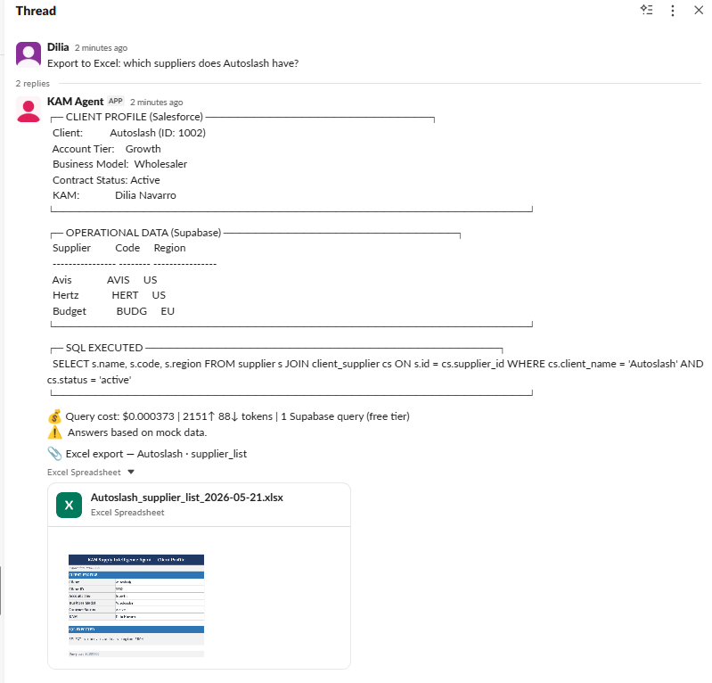

* File:
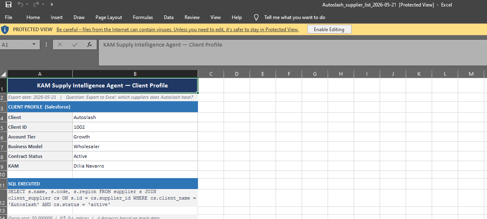

**The full pipeline is working end-to-end:**

- ✅ Slack message detected with export keyword
- ✅ Agent ran, XLSX generated on disk
- ✅ Flask /upload-to-slack streamed raw bytes to Slack's v2 API
- ✅ File appears in Slack with a proper preview thumbnail
- ✅ Opens correctly in Excel with full formatting — Client Profile, SQL section, cost footer

* More tests will be run, to make sure all is working properly

* Q1: Export to Excel: what are HappyCar's inbound products from France?

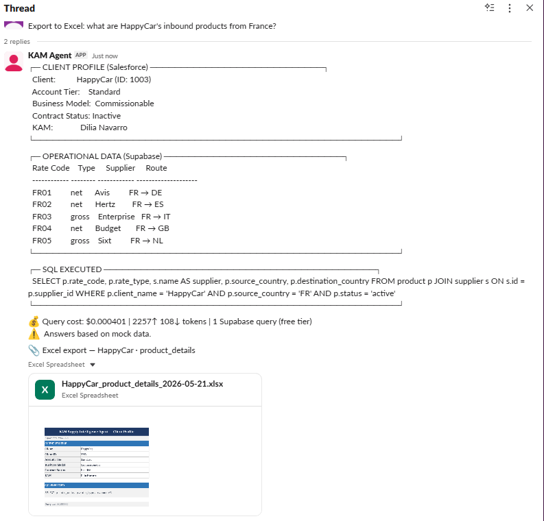

* Q2: How many suppliers does Check24 have? Export to Excel (this example should not return a file)

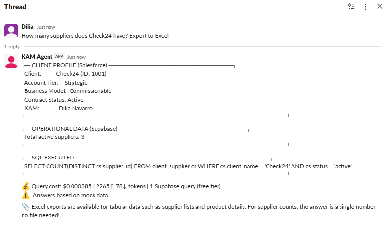

* Q3: Which products does Avis have for Autoslash? Send as spreadsheet

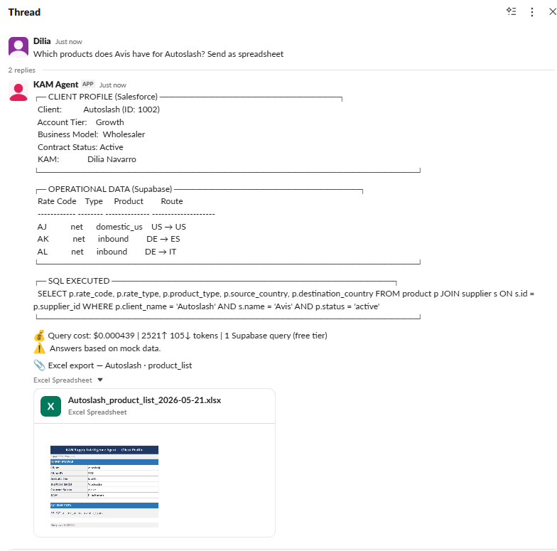

## US-14 — Documentation

The README covers all four acceptance criteria:

*	How to run locally — prerequisites, start server, start ngrok, verify, test without Slack
*	Environment variables — full table with where to find each credential
*	Architecture — plain-language node descriptions, no code theory
*	Prompt versions — change log table with the reason for each fix (useful for the next analyst who inherits this)
*	Salesforce field mapping — exact API names, display labels, mapping logic, and how to add a new field
*	ChromaDB — what's stored, how to update it, how to add a document, how to verify contents
*	XLSX export — trigger keywords, what exports for which question type, where files are saved
*	n8n + Slack — workflow structure, what to do if ngrok URL changes, troubleshooting checklist
*	Known limitations and V2 backlog — carried over from the demo log

## US-15 — Recording

A video was made using 4 different questions:

* Q1:  give me the product details for Autoslash with Budget. Export to excel

* Q2:  show me all ratecodes connected to Check24. Export to excel

* Q3:  Export to Excel: which suppliers does HappyCar have? .- there should be no export

* Q4: how many suppliers does Check24 have? Export to Excel .- there should be no export

**Link:**  https://www.loom.com/share/dcec82f2915a47509a65b6bf9fc0813f 

## US-16 — Compile and prioritise v2 feature backlog

## Sprint 3 Fixes Log

Issues identified during US-12 testing and the US-13 demo session that were resolved before end of sprint.

| # | Question / Issue | What happened | Root cause |
|---|---|---|---|
| PD-5 | "What are HappyCar's inbound products from France?" | Classified as `product_list` initially | UNDERSTAND prompt too narrow — fixed in Sprint 3 |
| PD-5 | `source_country` vs `destination_country` confusion | France treated as destination, not origin | SQL generation prompt missing geographic direction rules — fixed in Sprint 3 |
| PD-5 | `status = 'inactive'` generated instead of `'active'` | Wrong status filter in SQL | KEY RULES ambiguity — fixed in Sprint 3 |
| Contract status | HappyCar flickered Active/Inactive | `Active__c` field not mapped correctly | Missing `== 'Yes'` check — fixed in Sprint 3 |
| Mock data | HappyCar had no active products | All HappyCar products were inactive + no FR rows | Data gap in seed script — patched manually |

---

## V2 Backlog — Deferred Items

Items not resolved in Sprint 3, recommended for the next sprint cycle.

| # | Issue | Suggested v2 fix |
|---|---|---|
| V2-01 | No multi-turn conversation — each question is stateless | Add conversation memory / session context |
| V2-02 | Country names not always converted to ISO codes reliably | Add explicit country→ISO mapping table to ChromaDB glossary |
| V2-03 | `product_list` type rarely triggered, may be redundant | Review if `product_list` should be merged into `product_details` |
| V2-04 | No client-scoped access control | KAM should only see their own clients |
| V2-05 | Slack formatting is plain text | Upgrade to Slack Block Kit for richer layout |
| V2-06 | No query history or audit log | Log all questions + answers to Supabase |
| V2-07 | Free tier Supabase rate limits | Move to paid tier or production DB for live rollout |
| V2-08 | ChromaDB telemetry errors on every query | Pin or patch ChromaDB version to fix `capture()` signature |
