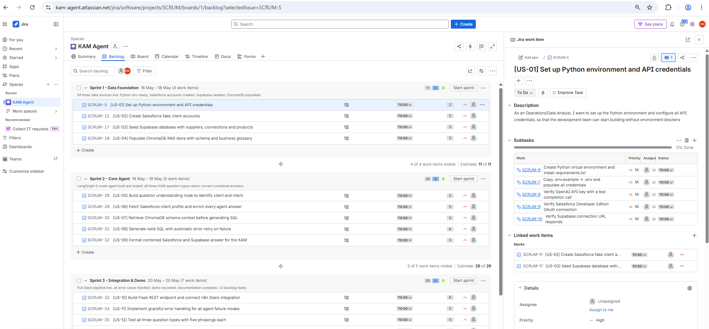
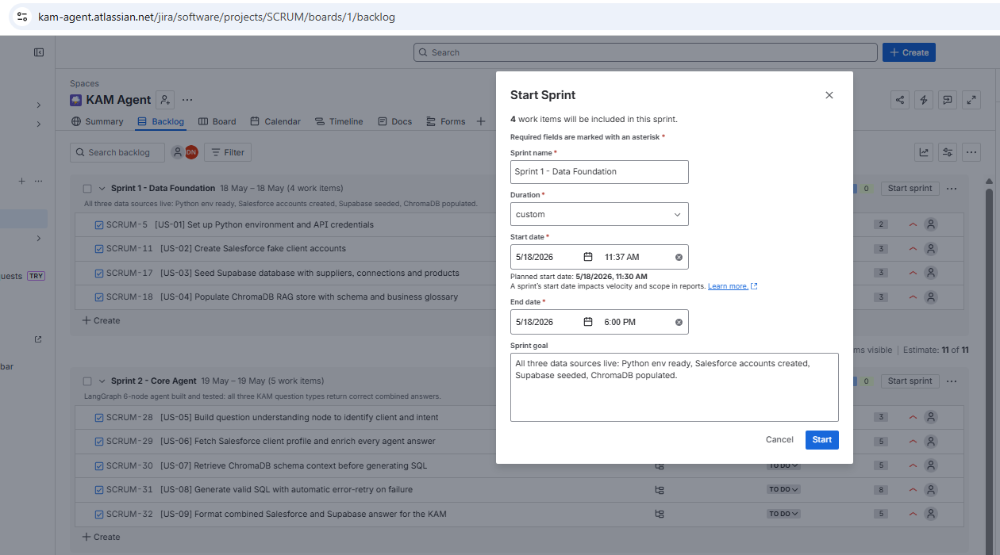
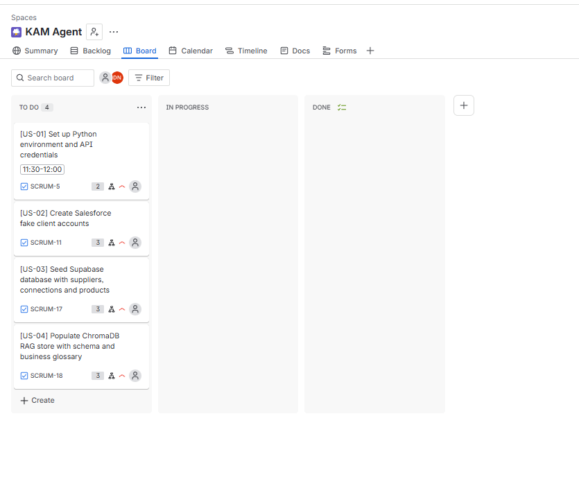
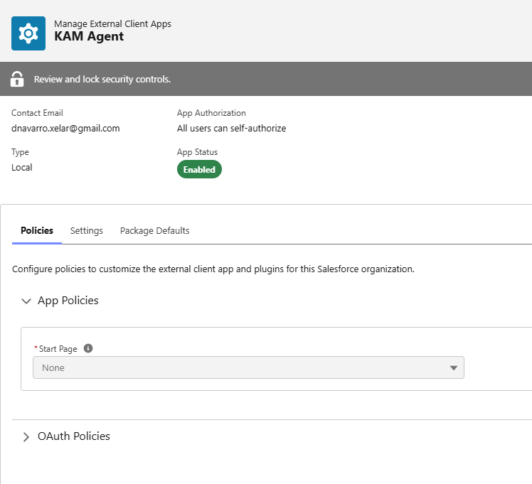
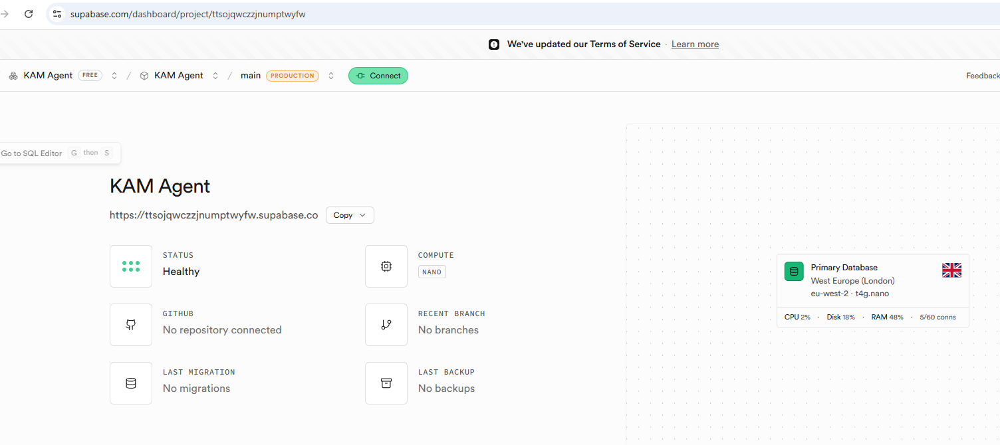
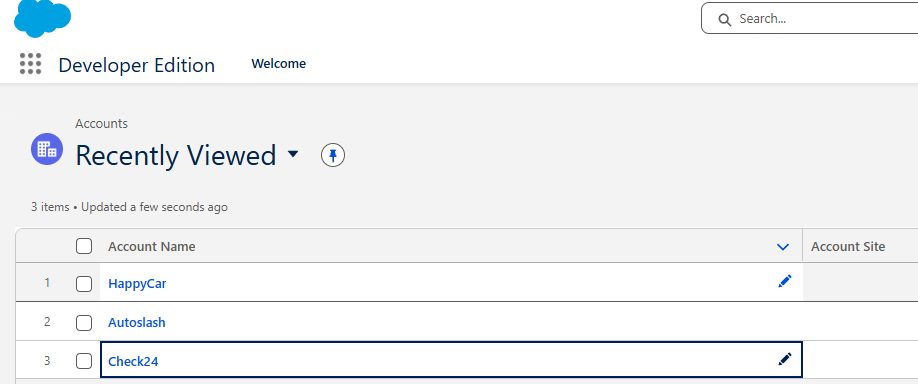
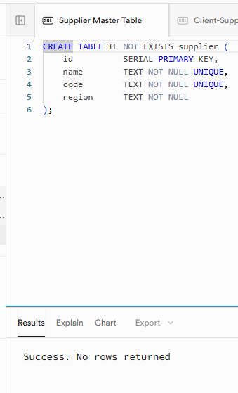
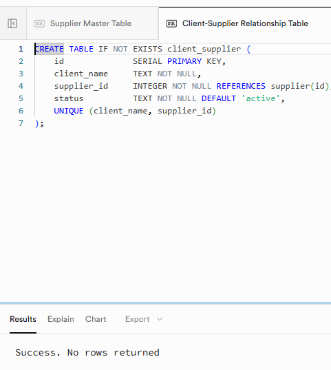
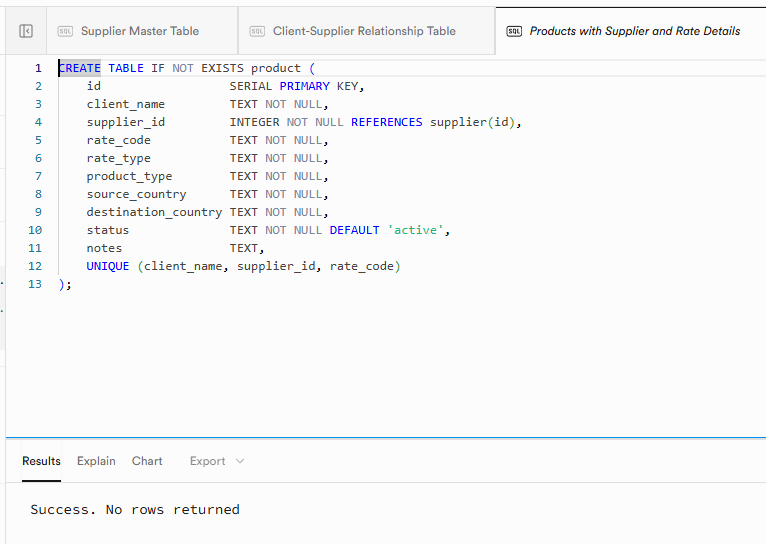
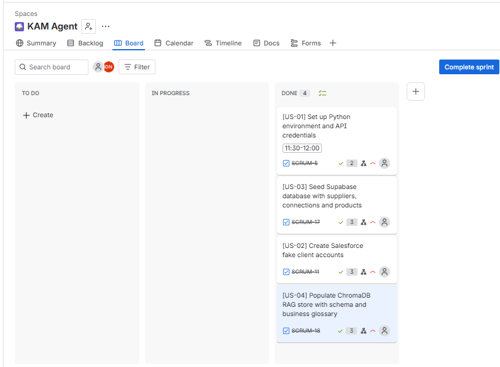

# First step: defining use case and creating user stories

* Refer to: `kam_agent_lab.md`

# Second step: Registering in JIRA for working with scrum:

**Reason:** Jira software provides a free tier that can be setup specifically for working with scrum (atlassian.com/software/jira/free)

* To invite a team member:

https://kam-agent.atlassian.net?continue=https%3A%2F%2Fkam-agent.atlassian.net%2Fwelcome%2Fsoftware&atlOrigin=eyJpIjoiNzk0ZGI0NjUxMTAxNGYwNzgxMzI4OTYyNThmMmE5NzgiLCJwIjoiaiJ9

**NOTE:** the project was adapted to be executed in 3 days.

### Steps:
* Create Sprints
* Create user stories (US) (description, subtasks, story points, priorities, which user stories would block them)
* Start Sprint

* Now I have my Jira board prepared:

* **Story points measures effort and complexity** 
- 2: Simple, low risk
- 3: Small, straightforward
- 5: Medium complexity
- 8: Large, has unknowns

* **Definition of Ready (DoR)**
- User story is written in standard format (As a… / I want… / So that…)
- Acceptance criteria are defined and agreed upon by Product Owner
- Story is estimated in story points by the development team
- All external dependencies are identified and documented
- No blocking technical unknowns remain (or are captured as sub-tasks)
- Required credentials / API access / environments are confirmed available

* **Definition of Done (DoD)**
- All acceptance criteria are met and verified
- Code is written, reviewed, and merged to main branch
- Unit tests pass for all new logic
- End-to-end test for the affected flow passes
- No hallucinated column or table names appear in any generated SQL
- Answer includes correct Salesforce client profile section
- Documentation updated (README, .env.example)
- Product Owner has reviewed and accepted the story

# Third step: starting with Sprint1

* SalesForce: developer.salesforce.com/signup
- => Token obtained and inserted in `.env` file

* Supabase: 

* running requirements.txt: pip install -r requirements.txt

* Testing credentials: 
✓ OpenAI connected — first model: text-embedding-ada-002
✗ Supabase failed: {'code': 'PGRST205', 'details': None, 'hint': None, 'message': "Could not find the table 'public.supplier' in the schema cache"}
✓ Salesforce connected — instance: https://orgfarm-0eccb3e7ef-dev-ed.develop.my.salesforce.com

The error from Supabase is due to not finding the supplier table, which is correct. This means that the setup is done!

In SalesForce need to be aware of changing the IP address: https://www.whatismyip.com/
=> Network Access
Start IP Address:  your.ip.address.here
End IP Address:    your.ip.address.here
Description:       Development local machine

Creating SF's accounts:

* **Mapping:**
| Our field |Salesforce field| Values|
|---|---|---|
|Client ID |Account Number| 1001, 1002, 1003|
|Account Tier |Customer Priority| High = Strategic, Medium = Growth, Low = Standard|
|Business Model| Type | Channel Partner = Commissionable, Technology Partner = Wholesaler|
|Contract Status| Active| Yes = Active, No = Inactive|
|Assigned KAM| Account Owner |Dilia Navarro (auto-filled)|

Creating tables in SQL:

Filling Database with fake values using: `db_setup.py`

Result: 

============================================================
KAM Agent — Supabase Database Setup
Clients: Check24 (commissionable) | Autoslash (wholesaler) | HappyCar (commissionable, inactive)
============================================================

[1] Creating tables...
  → If RPC fails, run the DDL below manually in
    Supabase Dashboard → SQL Editor:

CREATE TABLE IF NOT EXISTS supplier (
    id          SERIAL PRIMARY KEY,
    name        TEXT NOT NULL UNIQUE,
    code        TEXT NOT NULL UNIQUE,
    region      TEXT NOT NULL
);

CREATE TABLE IF NOT EXISTS client_supplier (
    id              SERIAL PRIMARY KEY,
    client_name     TEXT NOT NULL,
    supplier_id     INTEGER NOT NULL REFERENCES supplier(id),
    status          TEXT NOT NULL DEFAULT 'active',
    UNIQUE (client_name, supplier_id)
);

CREATE TABLE IF NOT EXISTS product (
    id                  SERIAL PRIMARY KEY,
    client_name         TEXT NOT NULL,
    supplier_id         INTEGER NOT NULL REFERENCES supplier(id),
    rate_code           TEXT NOT NULL,
    rate_type           TEXT NOT NULL,        -- 'net' or 'gross'
    product_type        TEXT NOT NULL,        -- 'domestic_us', 'inbound', 'outbound'
    source_country      TEXT NOT NULL,
    destination_country TEXT NOT NULL,
    status              TEXT NOT NULL DEFAULT 'active',
    notes               TEXT,
    UNIQUE (client_name, supplier_id, rate_code)
);

  ⚠ Could not auto-create 'supplier' via RPC: {'code': 'PGRST202', 'details': 'Searched for the function public.execute_sql with parameter query or with a single unnamed json/jsonb parameter, but no matches were found in the schema cache.', 'hint': None, 'message': 'Could not find the function public.execute_sql(query) in the schema cache'}
    → Run the DDL manually in Supabase SQL Editor
  ⚠ Could not auto-create 'client_supplier' via RPC: {'code': 'PGRST202', 'details': 'Searched for the function public.execute_sql with parameter query or with a single unnamed json/jsonb parameter, but no matches were found in the schema cache.', 'hint': None, 'message': 'Could not find the function public.execute_sql(query) in the schema cache'}
    → Run the DDL manually in Supabase SQL Editor
  ⚠ Could not auto-create 'product' via RPC: {'code': 'PGRST202', 'details': 'Searched for the function public.execute_sql with parameter query or with a single unnamed json/jsonb parameter, but no matches were found in the schema cache.', 'hint': None, 'message': 'Could not find the function public.execute_sql(query) in the schema cache'}
    → Run the DDL manually in Supabase SQL Editor

[2] Seeding suppliers...
  ✓ Avis (AVIS)
  ✓ Hertz (HERT)
  ✓ Enterprise (ENTP)
  ✓ Budget (BUDG)
  ✓ Sixt (SIXT)

[3] Seeding client-supplier connections...
  ✓ Check24 ↔ AVIS (active)
  ✓ Check24 ↔ HERT (active)
  ✓ Check24 ↔ ENTP (active)
  ✓ Autoslash ↔ AVIS (active)
  ✓ Autoslash ↔ HERT (active)
  ✓ Autoslash ↔ BUDG (active)
  ✓ HappyCar ↔ SIXT (inactive)
  ✓ HappyCar ↔ ENTP (inactive)

[4] Seeding products (rate codes)...
  ✓ Check24      | AVIS | JE | net   | domestic_us  (US→US) [active]
  ✓ Check24      | AVIS | JF | gross | domestic_us  (US→US) [active]
  ✓ Check24      | AVIS | KE | net   | inbound      (DE→ES) [active]
  ✓ Check24      | AVIS | KF | gross | inbound      (DE→ES) [active]
  ✓ Check24      | AVIS | KG | net   | inbound      (DE→IT) [active]
  ✓ Check24      | HERT | IT | net   | domestic_us  (US→US) [active]
  ✓ Check24      | HERT | IU | gross | domestic_us  (US→US) [active]
  ✓ Check24      | HERT | IV | net   | inbound      (DE→FR) [active]
  ✓ Check24      | HERT | IW | gross | inbound      (DE→FR) [active]
  ✓ Check24      | ENTP | EA | net   | domestic_us  (US→US) [active]
  ✓ Check24      | ENTP | EB | gross | domestic_us  (US→US) [active]
  ✓ Autoslash    | AVIS | AJ | net   | domestic_us  (US→US) [active]
  ✓ Autoslash    | AVIS | AK | net   | inbound      (DE→ES) [active]
  ✓ Autoslash    | AVIS | AL | net   | inbound      (DE→IT) [active]
  ✓ Autoslash    | HERT | HN | net   | domestic_us  (US→US) [active]
  ✓ Autoslash    | HERT | HO | net   | inbound      (DE→FR) [active]
  ✓ Autoslash    | BUDG | BU | net   | inbound      (DE→FR) [active]
  ✓ Autoslash    | BUDG | BV | net   | domestic_us  (US→US) [active]
  ✓ HappyCar     | SIXT | HX | net   | inbound      (DE→ES) [inactive]
  ✓ HappyCar     | SIXT | HY | gross | inbound      (DE→ES) [inactive]
  ✓ HappyCar     | SIXT | HZ | net   | domestic_us  (US→US) [inactive]
  ✓ HappyCar     | ENTP | HE | net   | inbound      (DE→IT) [inactive]
  ✓ HappyCar     | ENTP | HF | gross | inbound      (DE→IT) [inactive]

[5] Validation queries...
  ✓ Total suppliers: 5
  ✓ Check24      — 11 rate codes total | net: 6 | gross: 5
  ✓ Autoslash    —  7 rate codes total | net: 7 | gross: 0
  ✓ HappyCar     —  5 rate codes total | net: 3 | gross: 2

  Commissionable verification (should have both net and gross):
  ✓ CONFIRMED — Check24 has: {'gross', 'net'}
  ✓ CONFIRMED — HappyCar has: {'gross', 'net'}

  Wholesaler check (Autoslash — net only):
  ✓ CONFIRMED — Autoslash has: {'net'}

============================================================
Setup complete. Database is ready for the agent.
============================================================

* The RPC warnings are expected and harmless — the tables were already created manually. Everything else is 100% correct:

✅ 5 suppliers seeded
✅ 8 client-supplier connections
✅ 23 rate codes seeded
✅ Check24 confirmed commissionable (net + gross)
✅ Autoslash confirmed wholesaler (net only)
✅ HappyCar confirmed commissionable but inactive

* Testing both SQL and SalesForce: `SF_SQL_testing.py`

* Results:
✓ Salesforce — Check24 found:
    Name:              Check24
    Type:              Channel Partner / Reseller
    Customer Priority: High
    Active:            Yes

✓ Supabase Query 1 — Total suppliers: 5
✓ Supabase Query 2 — Check24 active suppliers: 3
    Avis
    Hertz
    Enterprise
✓ Supabase Query 3 — Check24 active rate codes: 11
    JE | net   | domestic_us  (US→US)
    JF | gross | domestic_us  (US→US)
    KE | net   | inbound      (DE→ES)
    KF | gross | inbound      (DE→ES)
    KG | net   | inbound      (DE→IT)
    IT | net   | domestic_us  (US→US)
    IU | gross | domestic_us  (US→US)
    IV | net   | inbound      (DE→FR)
    IW | gross | inbound      (DE→FR)
    EA | net   | domestic_us  (US→US)
    EB | gross | domestic_us  (US→US)

### Creating RAG:`seed_rag.py `

* Results:
============================================================
KAM Agent — ChromaDB RAG Store Seeding
Clients: Check24 | Autoslash | HappyCar
============================================================

[1] Connecting to ChromaDB...
Failed to send telemetry event ClientStartEvent: capture() takes 1 positional argument but 3 were given
  ✓ Connected — local persistent ChromaDB (./chroma_db/)

[2] Setting up OpenAI embedding function...

[3] Creating/loading collection 'kam_schema_store'...
Failed to send telemetry event ClientCreateCollectionEvent: capture() takes 1 positional argument but 3 were given
  ✓ Collection ready

[4] Seeding 8 documents...
  ✓ table_supplier
  ✓ table_client_supplier
  ✓ table_product
  ✓ glossary_rate_codes
  ✓ glossary_business_models
  ✓ glossary_product_types
  ✓ glossary_clients
  ✓ query_patterns

[5] Validation — test retrieval queries...
Failed to send telemetry event CollectionQueryEvent: capture() takes 1 positional argument but 3 were given
  ✓ 'What rate codes does Check24 have with Avis?' → glossary_rate_codes
  ✓ 'Does Autoslash have gross rates?' → glossary_rate_codes
  ✓ 'What is the difference between net and gross rates?' → glossary_business_models
  ✓ 'What does commissionable mean?' → glossary_rate_codes
  ✓ 'Which table has supplier connections to clients?' → table_client_supplier
  ✓ 'What are inbound products?' → glossary_product_types
  ✓ 'What domestic US rates does Check24 have?' → table_product

============================================================
Complete. 8 documents seeded into ChromaDB.
Local storage: ./chroma_db/
============================================================

Summary:
The "Failed to send telemetry" messages are harmless — just ChromaDB trying to send anonymous usage stats and failing, which is actually fine for privacy. Everything that matters worked perfectly.
All 8 documents seeded and all 7 retrieval queries returning correct results:

✅ Rate code questions → glossary_rate_codes
✅ Net/gross questions → glossary_business_models
✅ Supplier connection questions → table_client_supplier
✅ Inbound product questions → glossary_product_types
✅ Domestic US questions → table_product

### First Sprint Done!:

